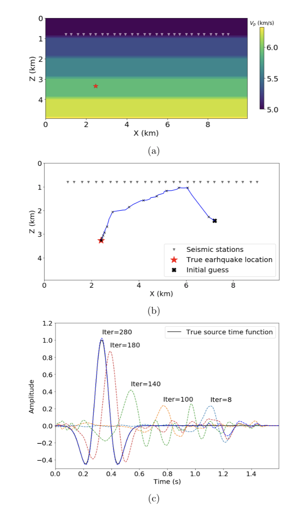
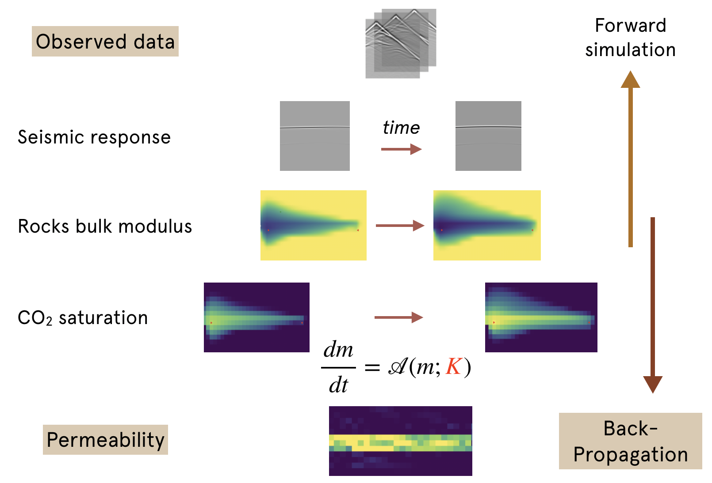
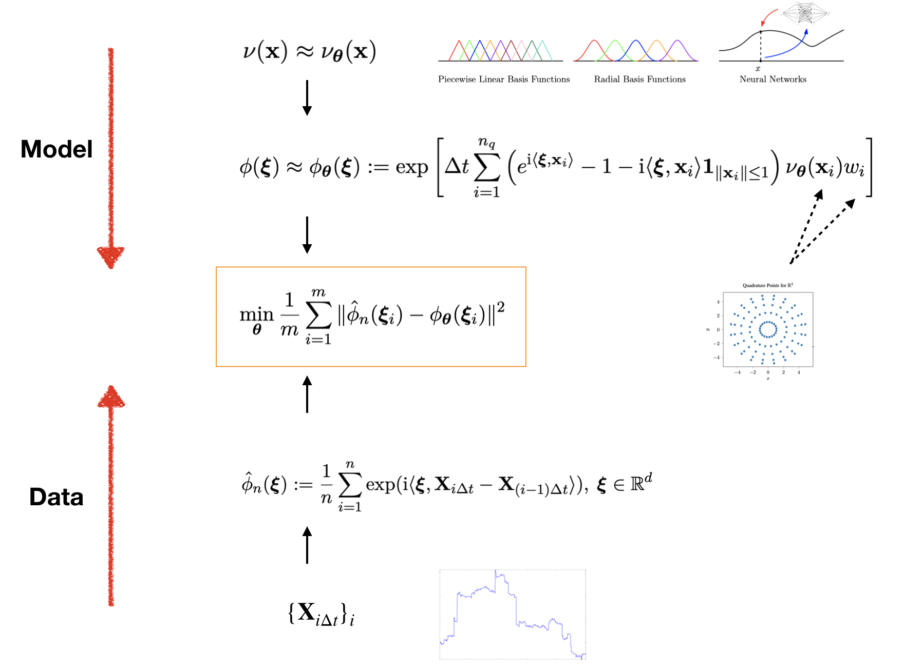

<p align="center">
  
</p>


The ADCME library (**A**utomatic **D**ifferentiation Library for **C**omputational and **M**athematical **E**ngineering) aims at general and scalable inverse modeling in scientific computing with gradient-based optimization techniques. It is built on the deep learning framework [TensorFlow](https://www.tensorflow.org/), which provides the automatic differentiation and parallel computing backend. The dataflow model adopted by the framework makes it suitable for high performance computing and inverse modeling in scientific computing. The design principles and methodologies are summarized in the [slides](https://kailaix.github.io/ADCME.jl/dev/assets/Slide/ADCME.pdf).

Several features of the library are

* *MATLAB-style syntax*. Write `A*B` for matrix production instead of `tf.matmul(A,B)`.
* *Custom operators*. Implement operators in C/C++ for bottleneck parts; incorporate legacy code or specially designed C/C++ code in `ADCME`; differentiate implicit schemes.
* *Numerical Scheme*. Easy to implement numerical schemes for solving PDEs.
* *Static graphs*. Compilation time computational graph optimization; automatic parallelism for your simulation codes.
* *Custom optimizers*. Large scale constrained optimization? Use `CustomOptimizer` to integrate your favorite optimizer. 
* *Sparse linear algebra*. Sparse linear algebra library tailored for scientific computing. 

Start building your forward and inverse modeling using ADCME today!

| Documentation                                                | Tutorial                                                     | Research                                                     |
| ------------------------------------------------------------ | ------------------------------------------------------------ | ------------------------------------------------------------ |
| [](https://kailaix.github.io/ADCME.jl/dev) | [](https://kailaix.github.io/ADCME.jl/dev/tutorial/) | [](https://kailaix.github.io/ADCME.jl/dev/apps) |

# Installation

⚠️ The latest version only supports Julia≧1.3.

⚠️ `PyCall` is forced to use the default interpreter by `ADCME`. Do not try to reset the interpreter by rebuilding `PyCall`. 

1. Install [Julia](https://julialang.org/)

2. Install `ADCME`
```
julia> ]
pkg> add ADCME
```

3. (Optional) Test `ADCME.jl`
```
julia> ]
pkg> test ADCME
```

4. (Optional) Enable GPU Support
To enable GPU support, first, make sure `nvcc` is available from your environment (e.g., type `nvcc` in your shell and you should get the location of the executable binary file).
```julia
ENV["GPU"] = 1
Pkg.build("ADCME")
```

For manual installation without access to the internet, see [here](https://kailaix.github.io/ADCME.jl/dev/).

# Tutorial

For a detailed tutorial, click [here](https://kailaix.github.io/ADCME.jl/dev/tutorial/). Consider solving the following problem

-bu''(x)+u(x) = f(x), x∈[0,1], u(0)=u(1)=0

where 

f(x) = 8 + 4x - 4x²

Assume that we have observed `u(0.5)=1`, we want to estimate `b`. The true value, in this case, should be `b=1`.

```julia
using LinearAlgebra
using ADCME

n = 101 # number of grid nodes in [0,1]
h = 1/(n-1)
x = LinRange(0,1,n)[2:end-1]

b = Variable(10.0) # we use Variable keyword to mark the unknowns
A = diagm(0=>2/h^2*ones(n-2), -1=>-1/h^2*ones(n-3), 1=>-1/h^2*ones(n-3)) 
B = b*A + I  # I stands for the identity matrix
f = @. 4*(2 + x - x^2) 
u = B\f # solve the equation using built-in linear solver
ue = u[div(n+1,2)] # extract values at x=0.5

loss = (ue-1.0)^2 

# Optimization
sess = Session(); init(sess) 
BFGS!(sess, loss)

println("Estimated b = ", run(sess, b))
```
Expected output 
```
Estimated b = 0.9995582304494237
```

The gradients can be obtained very easily. For example, if we want the gradients of `loss` with respect to `b`, the following code will create a Tensor for the gradient
```
julia> gradients(loss, b)
PyObject <tf.Tensor 'gradients_1/Mul_grad/Reshape:0' shape=() dtype=float64>
```

Under the hood, a computational graph is created for gradients back-propagation.


For more documentation, see [here](https://kailaix.github.io/ADCME.jl/dev).

# Featured Applications

| [Constitutive Modeling](https://kailaix.github.io/ADCME.jl/dev/apps_constitutive_law/) | [Seismic Inversion](https://kailaix.github.io/ADCME.jl/dev/apps_adseismic) | [Coupled Two-Phase Flow and Time-lapse FWI](https://kailaix.github.io/ADCME.jl/dev/apps_ad/) | [Calibrating Jump Diffusion](https://kailaix.github.io/ADCME.jl/dev/apps_levy/) |
| ------------------------------------------------------------ | ------------------------------------------------------------ | ------------------------------------------------------------ | ------------------------------------------------------------ |
|                               |                        |                               |                              |


# LICENSE

ADCME.jl is released under MIT License. See [License](https://github.com/kailaix/ADCME.jl/tree/master/LICENSE) for details. 
