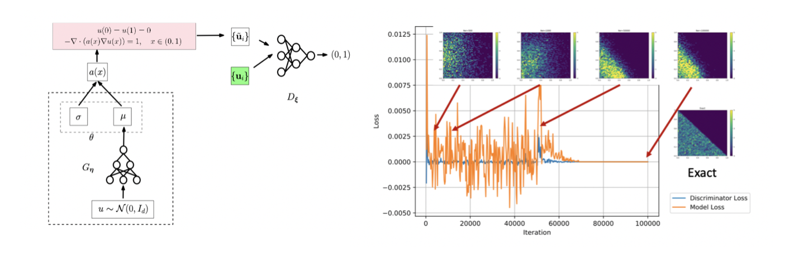

# Adversarial Numerical Analysis

---

Kailai Xu, and Eric Darve. "[Adversarial Numerical Analysis for Inverse Problems](https://arxiv.org/abs/1910.06936)"

[Project Website](https://github.com/kailaix/GAN)

---

Many scientific and engineering applications are formulated as inverse problems associated with stochastic models. In such cases the unknown quantities are distributions. The applicability of traditional methods is limited because of their demanding assumptions or prohibitive computational consumptions; for example, maximum likelihood methods require closed-form density functions, and Markov Chain Monte Carlo needs a large number of simulations. 

Consider the forward model

```math
x = F(w, \theta)
```

Here $w$ is a known stochastic process such as Gaussian processes, $\theta$ is an unknown parameter, distribution or stochastic processes. Consequently, the output of the model $x$ is also a stochastic process. $F$ can be a very complicated model such as a system of partial differential equations. Many models fall into this category; here  we solve an inverse modeling problem of boundary value Poisson equations

\begin{cases}
    -\nabla \cdot (a(x)\nabla u(x)) = 1 & x\in(0,1)\\\\
    u(0) = u(1) = 0 & \mbox{otherwise}
\end{cases}

```math
a(x) = 1-0.9\exp\left( -\frac{(x-\mu)^2}{2\sigma^2} \right)
```

Here ($\mu$, $\sigma$) is subject to unknown distribution ($\theta$ in the forward model). $w=\emptyset$ and $x$ is the solution to the equation, $u$. Assume we have observed a set of solutions $u_i$, and we want to estimate the distribution of ($\mu$, $\sigma$). Adversarial numerical analysis works as follows

1. The distribution ($\mu$, $\sigma$) is parametrized by a deep neural network $G_{\eta}$.

2. For each instance of ($\mu$, $\sigma$) sampled from the neural network parametrized distribution, we can compute a solution $u_{\mu, \sigma}$ using the finite difference method. 

3. We compute a metric between the *distribution* $u_{\mu, \sigma}$ and $u_i$ with a discriminative neural network $D_{\xi}$.

4. Minimize the metric by adjusting the weights of $G_{\eta}$ and $D_{\xi}$. 

The distribution of ($\mu$, $\sigma$) is given by $G_{\eta}$. The following plots show the workflow of adversarial numerical analysis and a sample result for the Dirichlet distribution. 



