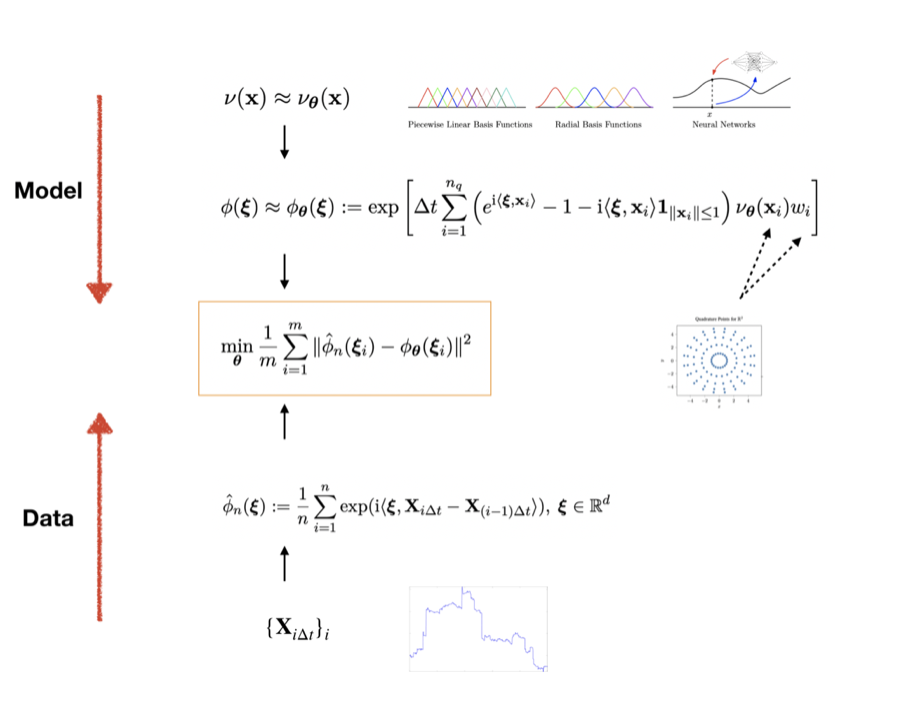

# Calibrating Multivariate Lévy Processes with Neural Networks

---

Kailai Xu and Eric Darve. "[Calibrating Multivariate Lévy Processes with Neural Networks](https://arxiv.org/abs/1812.08883)" 

[Project Website](https://github.com/kailaix/LevyNN.jl)

---

Calibrating a Lévy process usually requires characterizing its jump distribution. Traditionally this problem can be solved with nonparametric estimation using the empirical characteristic functions (ECF), assuming certain regularity, and results to date are mostly in 1D. For multivariate Lévy processes and less smooth Lévy densities, the problem becomes challenging as ECFs decay slowly and have large uncertainty because of limited observations. We solve this problem by approximating the Lévy density with a parametrized functional form; the characteristic function is then estimated using numerical integration. In our benchmarks, we used deep neural networks and found that they are robust and can capture sharp transitions in the Lévy density. They perform favorably compared to piecewise linear functions and radial basis functions. The methods and techniques developed here apply to many other problems that involve nonparametric estimation of functions embedded in a system model.


The Lévy process can be described by the Lévy-Khintchine formula

``\phi({\xi}) = \mathbb{E}[e^{\mathrm{i} \langle {\xi}, \mathbf{X}_t \rangle}] =\exp\left[t\left( \mathrm{i} \langle \mathbf{b}, {\xi} \rangle - \frac{1}{2}\langle {\xi}, \mathbf{A}{\xi}\rangle  +\int_{\mathbb{R}^d} \left( e^{\mathrm{i} \langle {\xi}, \mathbf{x}\rangle} - 1 - \mathrm{i} \langle {\xi}, \mathbf{x}\rangle \mathbf{1}_{\|\mathbf{x}\|\leq 1}\right)\nu(d\mathbf{x})\right) \right]``

Here the multivariate Lévy process is described by three parameters: a positive semi-definite matrix $\mathbf{A} = {\Sigma}{\Sigma}^T \in \mathbb{R}^{d\times d}$, where ${\Sigma}\in \mathbb{R}^{d\times d}$; a vector $\mathbf{b}\in \mathbb{R}^d$; and a measure $\nu\in \mathbb{R}^d\backslash\{\mathbf{0}\}$. 

Given a sample path $\mathbf{X}_{i\Delta t}$, $i=1,2,3,\ldots$, we focus on estimating $\mathbf{b}$, $\mathbf{A}$ and $\nu$. In this work, we focus on the functional inverse problem--estimate $\nu$--and assume $\mathbf{b}=0,\mathbf{A}=0$. The idea is

* The Lévy density is approximated by a parametric functional form---such as piecewise linear functions---with parameters $\theta$,
```math
    \nu(\mathbf{x}) \approx \nu_{\theta}(\mathbf{x})
```
* The characteristic function is approximated by numerical integration 
```math
\phi({\xi})\approx    \phi_{\theta}({\xi}) := \exp\left[ \Delta t \sum_{i=1}^{n_q} \left(e^{\mathrm{i} \langle{\xi}, \mathbf{x}_i \rangle}-1-\mathrm{i}\langle{\xi}, \mathbf{x}_i \rangle\mathbf{1}_{\|\mathbf{x}_i\|\leq 1}  \right)\nu_{\theta}(\mathbf{x}_i) w_i \right]
```
where $\{(\mathbf{x}_i, w_i)\}_{i=1}^{n_q}$ are quadrature nodes and weights.

* The empirical characteristic functions are computed given observations $\{\mathbf{X}_{i\Delta t}\}_{i=0}^n$

```math
\hat\phi_n({\xi}) := \frac{1}{n}\sum_{i=1}^n \exp(\mathrm{i}\langle {\xi}, \mathbf{X}_{i\Delta t}-\mathbf{X}_{(i-1)\Delta t}\rangle ),\  {\xi} \in \mathbb{R}^d
```

* Solve the following optimization problem with a gradient based method. Here $\{{\xi}_i \}_{i=1}^m$ are collocation points depending on the data. 
```math
\min_{\theta}\frac{1}{m} \sum_{i=1}^m \|\hat\phi_n({\xi}_i)-\phi_{\theta}({\xi}_i)  \|^2
```

We show the schematic description of the method and some results on calibrating a discontinuous Lévy density function $\nu$. 



