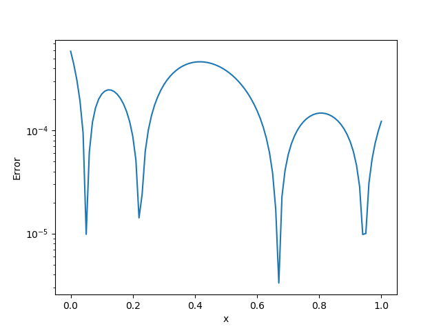
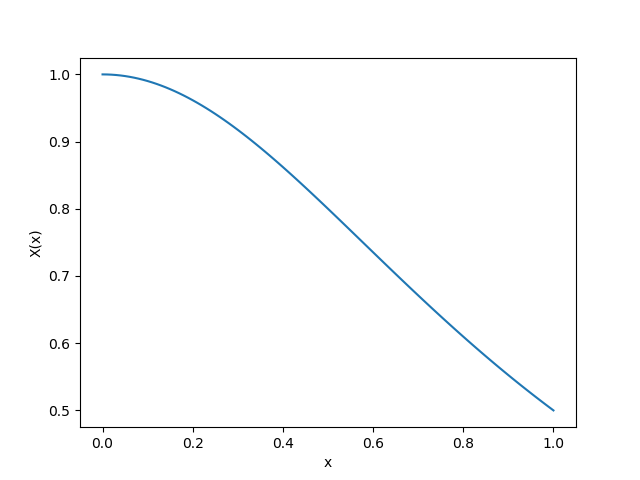

# Inverse Modeling with ADCME


In this section, we show how to solve the four types of inverse problems identified in [Inverse Modeling](). For simplicity, let the forward model be a 1D Poisson equation


$\begin{aligned}-\nabla (X\nabla u(x)) &= \varphi(x) & x\in (0,1)\\ u(0)=u(1) &= 0\end{aligned}$


Here $X$ is the unknown  which may be one of the four forms: parameter, function, functional or random variable. 

## Parameter Inverse Problem

When $X$ is just a scalar/vector, we call this type of problem **parameter inverse problem**. We consider a manufactured solution: the exact $X=1$ and $u(x)=x(1-x)$, so we have

```math 
\varphi(x) = 2
```

Assume we can observe $u(0.5)=0.25$ and the initial guess for $X_0=10$. We use finite difference method to discretize the PDE and the interval $[0,1]$ is divided uniformly to $0=x_0<x_1<\ldots<x_n=1$, with $n=100$, $x_{i+1}-x_i = h=\frac{1}{n}$.

we can solve the problem with the following code snippet

```julia
using ADCME
n = 100
h = 1/n
X0 = Variable(10.0)
A = X0 * diagm(0=>2/h^2*ones(n-1), 1=>-1/h^2*ones(n-2), -1=>-1/h^2*ones(n-2)) # coefficient matrix for the finite difference
φ = 2.0*ones(n-1) # right hand side
u = A\φ
loss = (u[50] - 0.25)^2

sess = Session(); init(sess)
BFGS!(sess, loss)
```

After around 7 iterations, the estimated $X_0$ converges to 1.0000000016917243. 

!!! info 

​	We can actually solve the linear system `A\φ` more efficiently by using [`SparseTensor`](@ref). In this case, simply substitute 

```Julia
A = X0 * diagm(0=>2/h^2*ones(n-1), 1=>-1/h^2*ones(n-2), -1=>-1/h^2*ones(n-2))
```

with 

```julia
A = X0 * SparseTensor(diagm(0=>2/h^2*ones(n-1), 1=>-1/h^2*ones(n-2), -1=>-1/h^2*ones(n-2)))
```


## Function Inverse Problem 

When $X$ is a function that does not depend on $u$, i.e., a function of location $x$, we call this type of problem **function inverse problem**. A common approach to this type of problem is to approximate the unknown function $X$ with a parametrized form, such as piecewise linear functions, radial basis functions or Chebyshev polynomials; sometimes we can also discretize $X$ and subtitute $X$ by a vector of its values at the discrete grid nodes. 

This tutorial is not aimed at comparison of different methods. Instead, we show how we can use neural networks to represent $X$ and train the neural network by coupling it with numerical schemes. The gradient calculation can be laborious with the traditional adjoint state methods but is trivial with automatic differentiation. 

Let's assume the true $X$ has the following form

```math
X(x) = \frac{1}{1+x^2}
```

The exact $\varphi$ is given by 

```math 
\varphi(x) = \frac{2 \left(x^{2} - x \left(2 x - 1\right) + 1\right)}{\left(x^{2} + 1\right)^{2}}
```

The idea is to use a neural network $\mathcal{N}(x;w)$ with weights and biases $w$ that maps the location $x\in \mathbb{R}$ to a scalar value such that

```math
\mathcal{N}(x; w)\approx X(x)
```

To find the optional $w$, we solve the Poisson equation with $X(x)=\mathcal{N}(x;w)$, where the numerical scheme is 

```math 
\left( -\frac{X_i+X_{i+1}}{2} \right) u_{i+1} + \frac{X_{i-1}+2X_i+X_{i+1}}{2} u_i + \left( -\frac{X_i+X_{i-1}}{2} \right) = \varphi(x_i) h^2
```

Here $X_i = \mathcal{N}(x_i; w)$. 

Assume we can observe the full solution $u(x)$, we can compared it with the solution $u(x;w)$, and minimize the loss function 

```math 
L(w) = \sum_{i=2}^{n-1} (u(x_i;w)-u(x_i))^2
```

```julia
using ADCME
n = 100
h = 1/n
x = collect(LinRange(0, 1.0, n+1))
X = ae(x, [20,20,20,1])^2  # to ensure that X is positive, we use NN^2 instead of NN
A = spdiag(
  n-1,
  1=>-(X[2:end-2] + X[3:end-1])/2,
  -1=>-(X[3:end-1] + X[2:end-2])/2,
  0=>(2*X[2:end-1]+X[3:end]+X[1:end-2])/2
)/h^2
φ = @. 2*x*(1 - 2*x)/(x^2 + 1)^2 + 2 /(x^2 + 1)
u = Array(A)\φ[2:end-1] # for efficiency, we can use A\φ[2:end-1] (sparse solver)
u_obs = (@. x * (1-x))[2:end-1]
loss = sum((u - u_obs)^2)

sess = Session(); init(sess)
BFGS!(sess, loss)
```


We show the exact $X(x)$ and the pointwise error in the following plots

```math 
\left|\mathcal{N}(x_i;w)-X(x_i)\right|
```


|  |  |
| ---------------------------- | ---------------------------- |
| Pointwise Absolute Error     | Exact $X(u)$                 |


## Functional Inverse Problem

In the **functional inverse problem**, $X$ is a function that _depends_ on $u$ (or both $x$ and $u$); it must not be confused with the functional inverse problem and it is much harder to solve (since the equation is nonlinear). For example, we may have

```math
X(u) = \frac{1}{1+100u^2}
```

The corresponding $\varphi$ is 

```math 
\frac{2 \left(100 x^{2} \left(x - 1\right)^{2} - 100 x \left(x - 1\right) \left(2 x - 1\right)^{2} + 1\right)}{\left(100 x^{2} \left(x - 1\right)^{2} + 1\right)^{2}}
```

To solve the Poisson equation, we use the standard Newton-Raphson scheme (see XXX), in which case, we need to compute the residual
$$
R_i = X'(u_i)\frac{u_{i+1}-u_{i-1}}{2h} + X(u_i)\frac{u_{i+1}+u_{i-1}-2u_i}{h^2} + \varphi(x_i)
$$
and the corresponding Jacobian
$$
\frac{\partial R_i}{\partial u_j} = \left\{ \begin{matrix}  \frac{X'(u_i)}{2h} + \frac{X(u_i)}{h^2} & j=i-1\\ X''(u_i)\frac{u_{i+1}-u_{i-1}}{2h} + X'(u_i)\frac{u_{i+1}+u_{i-1}-2u_i}{h^2} - \frac{2}{h^2}X(u_i) & j=i \\ -\frac{X'(u_i)}{2h} + \frac{X(u_i)}{h^2} & j=i+1\\ 0 & \mbox{otherwise}  \end{matrix} \right.
$$
Just like the function inverse problem, we also use a neural network to approximate $X(u)$; the difference is that the input of the neural network is $u$ instead of $x$. It is convenient to compute $X'(u)$ with automatic differentiation. If we had used piecewise linear functions, it is only possible to compute the gradients in the weak sense; but this is not a problem for neural network as long as we use smooth activation function such as $\tanh$. 

ADCME also prepares a built-in Newton-Raphson solver [`newton_raphson`](@ref) for you. To use this function, you only need to provide the residual and Jacobian 

```julia 
function residual_and_jacobian(θ, u)
  X = ae(u, [20,20,20,20,1], θ)+1.0 # to avoid X=0 at the first step 
  Xp = tf.gradients(X, u)[1]
  Xpp = tf.gradients(Xp, u)[1]
  up = [u[2:end];constant(zeros(1))]
  un = [constant(zeros(1)); u[1:end-1]]
  R = Xp * (up-un)/2h + X * (up+un-2u)/h^2 + φ
  dRdu = Xpp * (up-un)/2h + Xp*(up+un-2u)/h^2 - 2/h^2*X 
  dRdun = Xp[2:end]/2h + X[2:end]/h^2
  dRdup = -Xp[1:end-1]/2h + X[1:end-1]/h^2
  J = spdiag(n-1, 
	  -1=>dRdun,
  	  0=>dRdu,
      1=>dRdup)
  return R, Array(J)
end
```

Then we can solve the Poisson equation with 

```julia
newton_raphson(residual_and_jacobian, u0, θ)
```

One caveat here is that the Newton-Raphson operator is a [nonlinear implicit operator](https://kailaix.github.io/ADCME.jl/dev/inverse_modeling/#Forward-Operator-Types-1) which does not fall into the types of operators where automatic differentiation applies. Instead, a [special procedure]() is needed. Luckily, ADCME provides an API that abstracts away this technical difficulty and users can call [`NonlinearConstrainedProblem`](@ref) directly to extract the gradients. 

```julia
using ADCME 
# definitions of residual_and_jacobian is omited here
n = 100
h = 1/n
x = collect(LinRange(0, 1.0, n+1))

φ = @. 2*(x^2*(x - 1)^2 - x*(x - 1)*(2*x - 1)^2 + (x^2*(x - 1)^2 + 1)^2 + 1)/(x^2*(x - 1)^2 + 1)^2
φ = φ[2:end-1]
θ = Variable(ae_init([1,20,20,20,20,1]))
u0 = constant(zeros(n-1)) #initial guess
function L(u)
  u_obs = (@. x * (1-x))[2:end-1]
	loss = sum((u - u_obs)^2)
end
loss, solution, grad = NonlinearConstrainedProblem(residual_and_jacobian, L, θ, u0)

sess = Session(); init(sess)
BFGS!(sess, loss, grad, θ)
```

Note in this case, we only have one set of observations and the inverse problem may be ill-posed, i.e., the solution is not unique. Thus the best we can expect is that we can find one of the solutions $\mathcal{N}(x;w)$ that can reproduce the observation we have. This is indeed the case we encounter in this example: the reproduced solution is nearly the same as the observation, but we found a completely different $\mathcal{N}(x;w)$ compared with $X(u)$. 


## Stochastic Inverse Problem 

The final type of inverse problems is called **stochastic inverse problem**. In this problem, $X$ is a random variable with unknown distribution. Consequently, the solution $u$ will also be a random variable. For example, we may have the following settings in practice

- The measurement of $u(0.5)$ may not be accurate. We might assume that $u(0.5) \sim \mathcal{N}(\hat u(0.5), \sigma^2)$ where $\hat u(0.5)$ is one observation and $\sigma$ is the prescribed standard deviation of the measurement. Thus, we want to estimate the distribution of $X$ which will produces the same distribution for $u(0.5)$. This type of problem falls under the umbrella of **uncertainty quantification**. 
- The quantity $X$ itself is subject to randomness in nature, but its distribution may be positively/negatively skewed (e.g., stock price returns). We can measure several samples of $u(0.5)$ and want to estimate the distribution of $X$ based on the samples. This problem is also called **probablistic inverse problem**. 

We cannot simply minimize the distance between $u(0.5)$ and `u`   (which are random variables) as usual; instead, we need a metric to measure the discrepancy between two distributions--`u` and $u(0.5)$. The observables $u(0.5)$ may be given in multiple forms

- The probability density function. 
- The unnormalized log-likelihood function. 
- Discrete samples. 

We consider the third type in this tutorial. The idea is to construct a sampler for $X$ with a neural network and find the optimal weights and biases by minimizing the discrepancy between actual observed samples  and produced ones. Here is how we train the neural network:

We first propose a candidate neural network that transforms a sample from $\mathcal{N}(0, I_d)$ to a sample from $X$. Then we randomly generate $K$ samples $\{z_i\}_{i=1}^K$ from $\mathcal{N}(0, I_d)$ and transform them to $\{X_i; w\}_{i=1}^K$. We solve the Poisson equation $K$ times to obtain $\{u(0.5;z_i, w)\}_{i=1}^K$. Meanwhile, we sample $K$ items from the observations (e.g., with the bootstrap method) $\{u_i(0.5)\}_{i=1}^K$. We can use a probability metric $D$ to measure the discrepancy between $\{u(0.5;z_i, w)\}_{i=1}^K$ and $\{u_i(0.5)\}_{i=1}^K$. There are many choice for $D$, such as (they are not necessarily non-overlapped)

- Wasserstein distance (from optimal transport)
- KL-divergence, JS-divergence, etc. 

* Discriminator neural networks (from generative adversarial nets)

For example, we can implement a discriminator neural network approach to this problem. 

