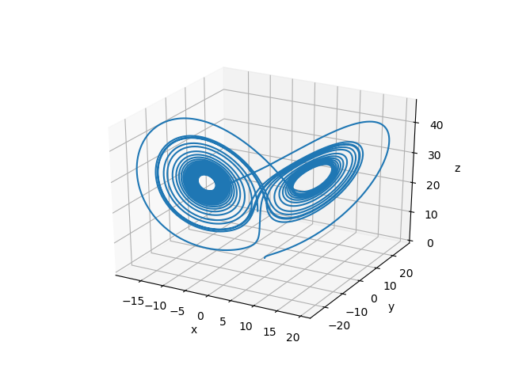

# PDE/ODE Solvers

!!! info
    The PDE/ODE solver features are currently under heavy development. We aim to provide a complete set of built-in PDE/ODE solvers.

## Runge Kutta Method
The Runge Kutta method is one of the workhorses for solving ODEs. The method is a higher order interpolation to the derivatives. The system of ODE has the form
```math
\frac{dy}{dt} = f(y, t, \theta)
```
where $t$ denotes time, $y$ denotes states and $\theta$ denotes parameters. 

The Runge-Kutta method is defined as
```math
\begin{align}
k_1 &= \Delta t f(t_n, y_n, \theta)\\
k_2 &= \Delta t f(t_n+\Delta t/2, y_n + k_1/2, \theta)\\
k_3 &= \Delta t f(t_n+\Delta t/2, y_n + k_2/2, \theta)\\
k_4 &= \Delta t f(t_n+\Delta t, y_n + k_3, \theta)\\
y_{n+1} &= y_n + \frac{k_1}{6} +\frac{k_2}{3} +\frac{k_3}{3} +\frac{k_4}{6}
\end{align}
```

ADCME provides a built-in Runge Kutta solver [`runge_kutta`](@ref). Consider an example: the Lorentz equation
```math
\begin{align}
\frac{dx}{dt} &= 10(y-x)\\ 
\frac{dy}{dt} &= x(27-z)-y\\ 
\frac{dz}{dt} &= xy -\frac{8}{3}z
\end{align}
```
Let the initial condition be $x_0 = [1,0,0]$, the following code snippets solves the Lorentz equation with ADCME
```julia
function f(t, y, θ)
    [10*(y[2]-y[1]);y[1]*(27-y[3])-y[2];y[1]*y[2]-8/3*y[3]]
end
x0 = [1.;0.;0.]
runge_kutta(x0, 30.0, 10000, f)
```

