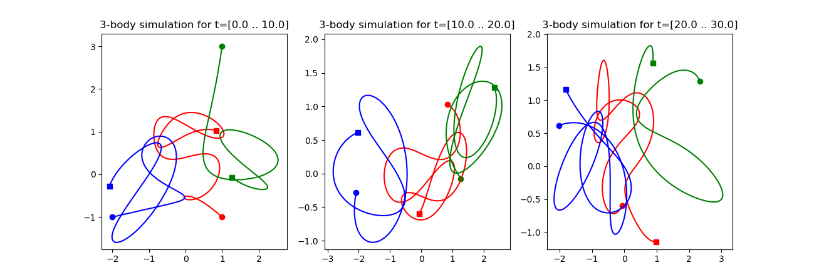

# PDE/ODE Solvers

!!! info
    The PDE/ODE solver features are currently under heavy development. We aim to provide a complete set of built-in PDE/ODE solvers.

## Runge Kutta Method
The Runge Kutta method is one of the workhorses for solving ODEs. The method is a higher order interpolation to the derivatives. The system of ODE has the form
```math
\frac{dy}{dt} = f(y, t, \theta)
```
where $t$ denotes time, $y$ denotes states and $\theta$ denotes parameters. 

The Runge-Kutta method is defined as

$\begin{aligned}
k_1 &= \Delta t f(t_n, y_n, \theta)\\
k_2 &= \Delta t f(t_n+\Delta t/2, y_n + k_1/2, \theta)\\
k_3 &= \Delta t f(t_n+\Delta t/2, y_n + k_2/2, \theta)\\
k_4 &= \Delta t f(t_n+\Delta t, y_n + k_3, \theta)\\
y_{n+1} &= y_n + \frac{k_1}{6} +\frac{k_2}{3} +\frac{k_3}{3} +\frac{k_4}{6}
\end{aligned}$

ADCME provides a built-in Runge Kutta solver [`rk4`](@ref) and [`ode45`](@ref). Consider an example: the Lorentz equation

$\begin{aligned}
\frac{dx}{dt} &= 10(y-x)\\ 
\frac{dy}{dt} &= x(27-z)-y\\ 
\frac{dz}{dt} &= xy -\frac{8}{3}z
\end{aligned}$

Let the initial condition be $x_0 = [1,0,0]$, the following code snippets solves the Lorentz equation with ADCME
```julia
function f(t, y, θ)
    [10*(y[2]-y[1]);y[1]*(27-y[3])-y[2];y[1]*y[2]-8/3*y[3]]
end
x0 = [1.;0.;0.]
rk4(f, 30.0, 10000, x0)
```


We can also solve three body problem with the Runge-Kutta method. The full script is 
```julia
# 
# adapted from 
# https://github.com/pjpmarques/Julia-Modeling-the-World/
# 
using Revise
using ADCME
using PyPlot
using Printf

function f(t, y, θ)
    # Extract the position and velocity vectors from the g array
    r0, v0 = y[1:2], y[3:4]
    r1, v1 = y[5:6], y[7:8]
    r2, v2 = y[9:10], y[11:12]
    
    # The derivatives of the position are simply the velocities
    dr0 = v0
    dr1 = v1
    dr2 = v2
    
    # Now calculate the the derivatives of the velocities, which are the accelarations
    # Start by calculating the distance vectors between the bodies (assumes m0, m1 and m2 are global variables)
    # Slightly rewriten the expressions dv0, dv1 and dv2 comprared to the normal equations so we can reuse d0, d1 and d2
    d0  = (r2 - r1) / ( norm(r2 - r1)^3.0 )
    d1  = (r0 - r2) / ( norm(r0 - r2)^3.0 )
    d2  = (r1 - r0) / ( norm(r1 - r0)^3.0 )    
    
    dv0 = m1*d2 - m2*d1
    dv1 = m2*d0 - m0*d2
    dv2 = m0*d1 - m1*d0
    
    # Reconstruct the derivative vector
    [dr0; dv0; dr1; dv1; dr2; dv2]
end

function plot_trajectory(t1, t2)

    t1i = round(Int,NT * t1/T) + 1
    t2i = round(Int,NT * t2/T) + 1
    
    # Plot the initial and final positions
    # In these vectors, the first coordinate will be X and the second Y
    X = 1
    Y = 2
    
    # figure(figsize=(6,6))
    plot(r0[t1i,X], r0[t1i,Y], "ro")
    plot(r0[t2i,X], r0[t2i,Y], "rs")
    plot(r1[t1i,X], r1[t1i,Y], "go")
    plot(r1[t2i,X], r1[t2i,Y], "gs")
    plot(r2[t1i,X], r2[t1i,Y], "bo")
    plot(r2[t2i,X], r2[t2i,Y], "bs")
    
    # Plot the trajectories
    plot(r0[t1i:t2i,X], r0[t1i:t2i,Y], "r-")
    plot(r1[t1i:t2i,X], r1[t1i:t2i,Y], "g-")
    plot(r2[t1i:t2i,X], r2[t1i:t2i,Y], "b-")
    
    # Plot cente of mass
    # plot(cx[t1i:t2i], cy[t1i:t2i], "kx")
    
    # Setup the axis and titles
    xmin = minimum([r0[t1i:t2i,X]; r1[t1i:t2i,X]; r2[t1i:t2i,X]]) * 1.10
    xmax = maximum([r0[t1i:t2i,X]; r1[t1i:t2i,X]; r2[t1i:t2i,X]]) * 1.10
    ymin = minimum([r0[t1i:t2i,Y]; r1[t1i:t2i,Y]; r2[t1i:t2i,Y]]) * 1.10
    ymax = maximum([r0[t1i:t2i,Y]; r1[t1i:t2i,Y]; r2[t1i:t2i,Y]]) * 1.10
    
    axis([xmin, xmax, ymin, ymax])
    title(@sprintf "3-body simulation for t=[%.1f .. %.1f]" t1 t2)
end;

m0 = 5.0
m1 = 4.0
m2 = 3.0

# Initial positions and velocities of each body (x0, y0, vx0, vy0) 
gi0 = [ 1.0; -1.0; 0.0; 0.0]
gi1 = [ 1.0;  3.0; 0.0; 0.0]
gi2 = [-2.0; -1.0; 0.0; 0.0]


T  = 30.0
NT  = 500*300
g0  = [gi0; gi1; gi2]

res_ = ode45(f, T, NT, g0)

sess = Session(); init(sess)
res = run(sess, res_)

r0, v0, r1, v1, r2, v2 = res[:,1:2], res[:,3:4], res[:,5:6], res[:,7:8], res[:,9:10], res[:,11:12]

figure(figsize=[4,1])
subplot(131); plot_trajectory(0.0,10.0)
subplot(132); plot_trajectory(10.0,20.0)
subplot(133); plot_trajectory(20.0,30.0)
```


