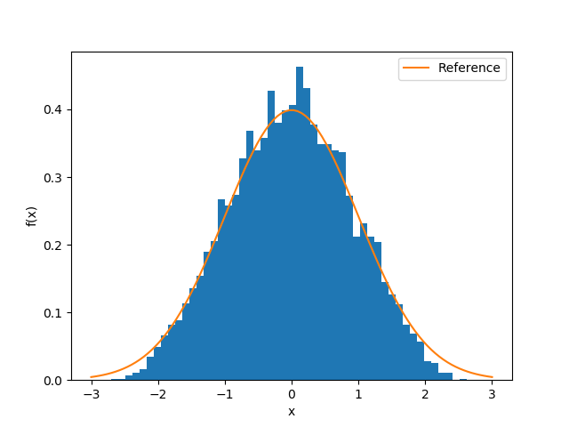
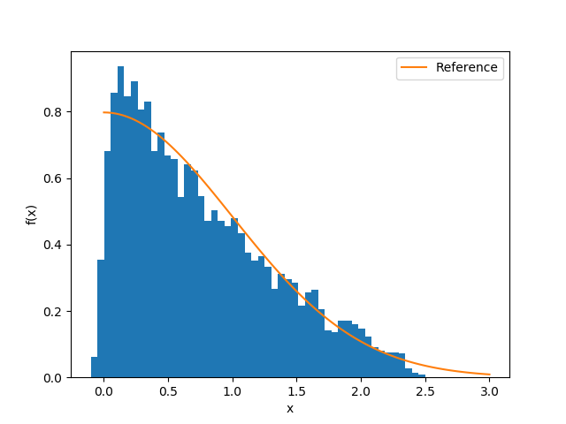

# Optimal Transport

Optimal transport (OT) can be used to measure the "distance" between two probability distribution. In this chapter, we introduce a novel approach for training a general model: SinkHorn Generative Networks (SGN). In this approach, a neural network is used to transform a sample from uniform distributions to a sample of targeted distribution. We train the neural network by minimizing the discrepancy between the targeted distribution and the desired distribution, which is described by optimal transport distance. Different from generative adversarial nets (GAN), we do not use a discriminator neural network to construct the discrepancy; instead, it is computed directly with efficient SinkHorn algorithm. The minimization is conducted via a gradient-based optimizer, where the gradients are computed with reverse mode automatic differentiation. 

To begin with, we first construct the sample `x` of the targeted distribution and the sample `s` from the desired distribution and compute the loss function with [`sinkhorn`](@ref)

```julia
using Revise
using ADCME
using PyPlot

reset_default_graph()
K = 64
z = placeholder(Float64, shape=[K, 10])
x = squeeze(ae(z, [20,20,20,1]))
s = placeholder(Float64, shape=[K])
M = abs(reshape(x, -1, 1) - reshape(s, 1, -1))
loss = sinkhorn(ones(K)/K, ones(K)/K, M, reg=0.1)
```

**Example 1**
In the first example, we assume the desired distribution is the standard Gaussian. We minimize the loss function with [`AdamOptimizer`](@ref)
```julia
opt = AdamOptimizer().minimize(loss)
sess = Session(); init(sess)
for i = 1:10000
    _, l = run(sess, [opt, loss], z=>rand(K, 10), s=>randn(K))
    @show i, l
end
```

The result is shown below
```julia
V = []
for k = 1:100
    push!(V,run(sess, x, z=>rand(K,10)))
end
V = vcat(V...)
hist(V, bins=50, density=true)
x0 = LinRange(-3.,3.,100)
plot(x0, (@. 1/sqrt(2π)*exp(-x0^2/2)), label="Reference")
xlabel("x")
ylabel("f(x)")
legend()
```


**Example 2**
In the first example, we assume the desired distribution is the positive part of the the standard Gaussian. 
```julia
opt = AdamOptimizer().minimize(loss)
sess = Session(); init(sess)
for i = 1:10000
    _, l = run(sess, [opt, loss], z=>rand(K, 10), s=>abs.(randn(K)))
    @show i, l
end
```


