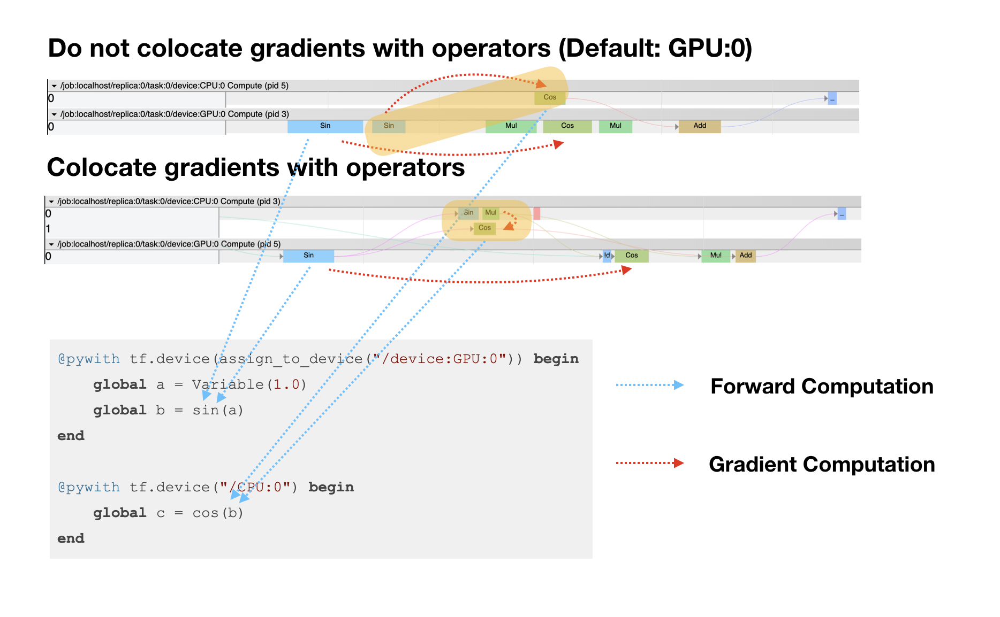

# Parallel Computing

The ADCME backend, TensorFlow, treats each operator as the smallest computation unit. Users are allowed to manually assign each operator to a specific device (GPU, CPU, or TPU). This is usually done with the `@pywith tf.device("/cpu:0")` syntax. For example, if we want to create a variable `a` and compute $\sin(a)$ on `GPU:0` we can write
```julia
@pywith tf.device("/GPU:0") begin
    global a = Variable(1.0)
    global b = sin(a)
end
```

**Custom Device Placement Functions**

The above placement function is useful and simple for placing operators on certain GPU devices without changing original codes. However, sometimes we want to place certain operators on certain devices. This can be done by implementing a custom `assign_to_device` function. As an example, we want to place all `Variables` on CPU:0 while placing all other operators on GPU:0, the code has the following form
```julia
PS_OPS = ["Variable", "VariableV2", "AutoReloadVariable"]
function assign_to_device(device, ps_device="/device:CPU:0")
    function _assign(op)
        node_def = pybuiltin("isinstance")(op, tf.NodeDef) ? op : op.node_def
        if node_def.op in PS_OPS
            return ps_device
        else
            return device
        end
    end

    return _assign
end
```
Then we can write something like
```julia
@pywith tf.device(assign_to_device("/device:GPU:0")) begin
    global a = Variable(1.0)
    global b = sin(a)
end
```
We can check the location of `a` and `b` by inspecting their `device` attributes
```julia-repl
julia> a.device
"/device:CPU:0"

julia> b.device
"/device:GPU:0"
```

**Collocate Gradient Operators**

When we call `gradients`, TensorFlow actually creates a set of new operators, one for each operator in the forward computation. By default, those operators are placed on the default device (`GPU:0` if GPU is available; otherwise it's `CPU:0`). Sometimes we want to place the operators created by gradients on the same devices as the corresponding forward computation operators. For example, if the operator `b` (`sin`) in the last example is on `GPU:0`, we hope the corresponding gradient computation (`cos`) is also on `GPU:0`. This can be done by specifying `colocate` [^colocate] keyword arguments in `gradients`:
[^colocate]: Unfortunately, in the TensorFlow APIs, "collocate" is spelt as "colocate". 
```julia
@pywith tf.device(assign_to_device("/device:GPU:0")) begin
    global a = Variable(1.0)
    global b = sin(a)
end

@pywith tf.device("/CPU:0") begin
    global c = cos(b)
end

g = gradients(c, a, colocate=true)
```
In the following figure, we show the effects of `colocate` of the above codes. The test code snippet is
```julia
g = gradients(c, a, colocate=true)
sess = Session(); init(sess)
run_profile(sess, g+c)
save_profile("true.json")

g = gradients(c, a, colocate=false)
sess = Session(); init(sess)
run_profile(sess, g+c)
save_profile("false.json")
```



!!! note
  If you use `bn` (batch normalization) on multi-GPUs, you must be careful to update the parameters in batch normalization on CPUs. This can be done by explicitly specify 
  ```julia
  @pywith tf.device("/cpu:0") begin
    global update_ops = get_collection(tf.GraphKeys.UPDATE_OPS)
  end
  ```
  and bind `update_ops` to an active operator (or explictly execute it in `run(sess,...)`).