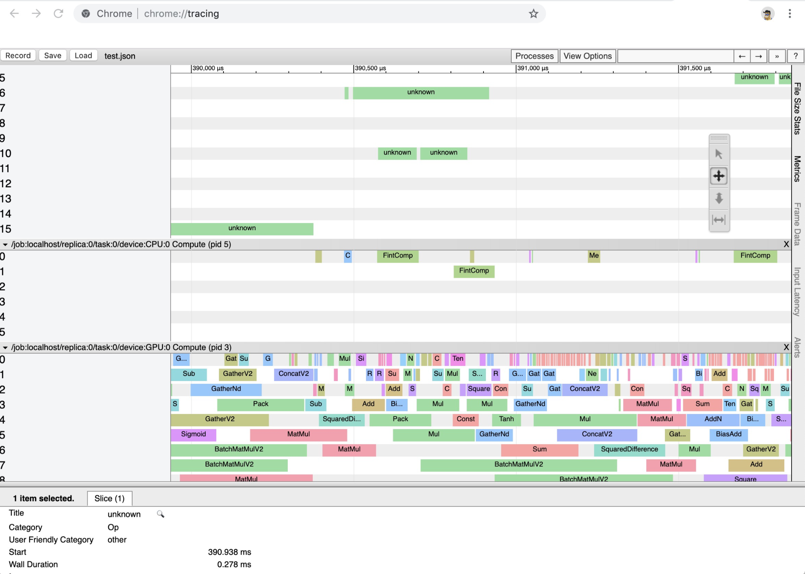

# Advanced: Debugging

There are many handy tools implemented in `ADCME` for analysis, benchmarking, input/output, etc. 

## Debugging and Printing

Add the following line before `Session` and change `tf.Session` to see verbose printing (such as GPU/CPU information)
```julia
tf.debugging.set_log_device_placement(true)
```

`tf.print` can be used for printing tensor values. It must be binded with an executive operator.
```julia
# a, b are tensors, and b is executive
op = tf.print(a)
b = bind(b, op)
```

## Debugging Python Codes

If the error comes from Python (through PyCall), we can print out the Python trace with the following commands

```python
import traceback
try:
    # Your codes here 
except Exception:
    print(traceback.format_exc())
```

This Python script can be inserted to Julia and use interpolation to invoke Julia functions (in the comment line).

As an application, we can use this trick to debug "NotFoundError" for custom operators
```julia
using ADCME, PyCall
py"""
import tensorflow as tf
import traceback
try:
    tf.load_op_library("../libMyOp.so")
except Exception:
    print(traceback.format_exc())
"""
```

## Profiling

Profiling can be done with the help of [`run_profile`](@ref) and [`save_profile`](@ref)
```julia
a = normal(2000, 5000)
b = normal(5000, 1000)
res = a*b 
run_profile(sess, res)
save_profile("test.json")
```
- Open Chrome and navigate to chrome://tracing
- Load the timeline file

Below shows an example of profiling results.




## Save and Load Diary

We can use TensorBoard to track a scalar value easily
```julia
d = Diary("test")
p = placeholder(1.0, dtype=Float64)
b = constant(1.0)+p
s = scalar(b, "variable")
for i = 1:100
    write(d, i, run(sess, s, Dict(p=>Float64(i))))
end
activate(d)
```

