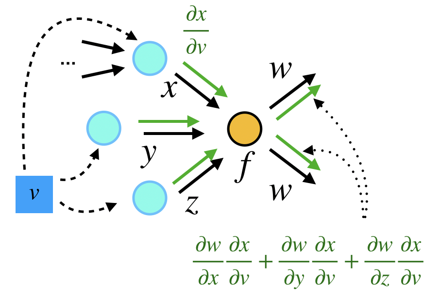
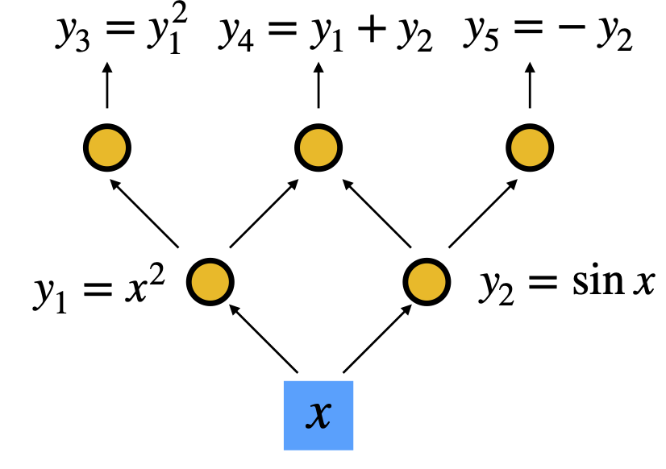
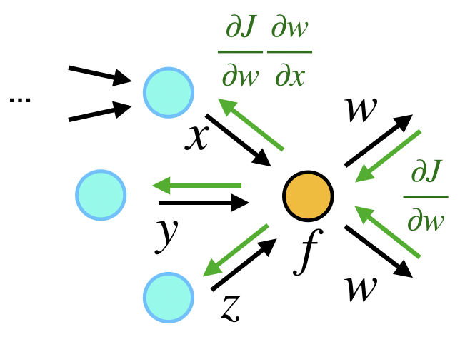

# What is ADCME? Computational Graph, Automatic Differentiation & TensorFlow

## Computational Graph	

A computational graph is a functional description of the required computation. In the computationall graph, an edge represents a value, such as a scalar, a vector, a matrix or a tensor. A node represents a function whose input arguments are the the incoming edges and output values are are the outcoming edges. Based on the number of input arguments, a function can be nullary, unary, binary, ..., and n-ary; based on the number of output arguments, a function can be single-valued or multiple-valued. 


Computational graphs are directed and acyclic. The acyclicity implies the forward propagation computation is well-defined: we loop over edges in topological order and evaluates the outcoming edges for each node. To make the discussion more concrete, we illustrate the computational graph for 

$$z = \sin(x_1+x_2) + x_2^2 x_3$$


There are in general two programmatic ways to construct computational graphs: static and dynamic declaration. In the static declaration, the computational graph is first constructed symbolically, i.e., no actual numerical arithmetic are executed. Then a bunch of data is fed to the graph for the actual computation. An advantage of static declarations is that they allow for graph optimization such as removing unused branches. Additionally, the dependencies can be analyzed for parallel execution of independent components. Another approach is the dynamic declaration, where the computational graph is constructed on-the-fly as the forward computation is executed. The dynamic declaration interleaves construction and evaluation of the graph, making software development more intuitive. 

## Automatic Differentiation

An important application of computational graphs is automatic differentiation (AD). In general, there are three modes of AD: reverse-mode, forward-mode, and mixed mode. In this tutorial, we focus on the forward-mode and reverse-mode.

Basically, the forward mode and the reverse mode automatic differenation both use the. chain rule for computing the gradients. They evaluate the gradients of "small" functions analytically (symbolically) and chain all the computed **numerical** gradients via the chain rule

$$\frac{\partial f\circ g (x)}{\partial x} = \frac{\partial f'\circ g(x)}{\partial g} {\frac{\partial g'(x)}{\partial x}}$$

### Forward Mode

In the forward mode, the gradients are computed in the same order as function evaluation, i.e., ${\frac{\partial g'(x)}{\partial x}}$ is computed first, and then $\frac{\partial f'\circ g(x)}{\partial g} {\frac{\partial g'(x)}{\partial x}}$ as a whole. The idea is the same for a computational graph, except that we need to **aggregate** all the gradients from up-streams first, and then **forward** the gradients to down-stream nodes. Here we show how the gradient 

$$f(x) = \begin{bmatrix}
			x^4\\
			x^2 + \sin(x) \\
			-\sin(x)\end{bmatrix}$$

is computed.

| Forward-mode AD in the Computational Graph | Example                       |
| ------------------------------------------ | ----------------------------- |
|                       |  |


### Reverse Mode

In contrast, the reverse-mode AD computes the gradient  in the reverse order of forward computation, i.e., $\frac{\partial f'\circ g(x)}{\partial g}$ is first evaluated and then $\frac{\partial f'\circ g(x)}{\partial g} {\frac{\partial g'(x)}{\partial x}}$ as a whole. In the computational graph, each node first aggregate all the gradients from down-streams  and then back-propagates the gradient to upstream nodes.

We show how the gradients of $z = \sin(x_1+x_2) + x_2^2 x_3$ is evaluated. 


| Reverse-mode AD in the Computational Graph | Step 1                 | Step 2                 | Step 3                 | Step 4                 |
| ------------------------------------------ | ---------------------- | ---------------------- | ---------------------- | ---------------------- |
|                       |  |  |  |  |


## Comparison

Reverse-mode AD reuses gradients from down-streams. Therefore, this mode is useful for many-to-few mappings. In contrast, forward-mode AD reuses gradients from upstreams. This mechanism makes forward-mode AD suitable for few-to-many mappings. Therefore, for inverse modeling problems where the objective function is usually a scalar, reverse-mode AD is most relevant. For uncertainty quantification or sensitivity analysis, the forward-mode AD is most useful. We summarize the two modes in the following table:

For a function $f:\mathbf{R}^n \rightarrow \mathbf{R}^m$

| Mode    | Suitable for... | Complexity[^OPS]               | Application      |
| ------- | --------------- | ------------------------------ | ---------------- |
| Forward | $m\gg n$        | $\leq 2.5\;\mathrm{OPS}(f(x))$ | UQ               |
| Reverse | $m\ll n$        | $\leq 4\;\mathrm{OPS}(f(x))$   | Inverse Modeling |

[^OPS]: See "Margossian CC. A review of automatic differentiation and its efficient implementation. Wiley Interdisciplinary Reviews: Data Mining and Knowledge Discovery. 2019 Jul;9(4):e1305.".

## A Mathematical Description of Reverse-mode Automatic Differentiation

Because the reverse-mode automatic differentiation is very important for inverse modeling, we devote this section to a rigorious mathematical description of the reverse-mode automatic differentiation. 

To explain how reverse-mode AD works, let's consider constructing a computational graph with independent variables 

$$\{x_1, x_2, \ldots, x_n\}$$

and the forward propagation produces a single output $x_N$, $N>n$. The gradients $\frac{\partial x_N(x_1, x_2, \ldots, x_n)}{\partial x_i}$
$i=1$, $2$, $\ldots$, $n$ are queried. 

The idea is that this algorithm can be decomposed into a sequence of functions $f_i$ ($i=n+1, n+2, \ldots, N$) that can be easily differentiated analytically, such as addition, multiplication, or basic functions like exponential, logarithm and trigonometric functions. Mathematically, we can formulate it as

$$\begin{aligned}
    x_{n+1} &= f_{n+1}(\mathbf{x}_{\pi({n+1})})\\
    x_{n+2} &= f_{n+2}(\mathbf{x}_{\pi({n+2})})\\
    \ldots\\
    x_{N} &= f_{N}(\mathbf{x}_{\pi({N})})\\
\end{aligned}$$

where $\mathbf{x} = \{x_i\}_{i=1}^N$ and $\pi(i)$ are the parents of $x_i$, s.t., $\pi(i) \in \{1,2,\ldots,i-1\}$.


The idea to compute $\partial x_N / \partial x_i$ is to start from $i = N$, and establish recurrences to calculate derivatives with respect to $x_i$ in terms of derivatives with respect to $x_j$, $j >i$. To define these recurrences rigorously, we need to define different functions that differ by the choice of independent variables.

The starting point is to define $x_i$ considering all previous $x_j$, $j < i$, as independent variables. Then:

$$x_i(x_1, x_2, \ldots, x_{i-1}) = f_i(\mathbf{x}_{\pi(i)})$$

Next, we observe that $x_{i-1}$ is a function of previous $x_j$, $j < i-1$, and so on; so that we can recursively define $x_i$ in terms of fewer independent variables, say in terms of $x_1$, ..., $x_k$, with $k < i-1$. This is done recursively using the following definition:

$$x_i(x_1, x_2, \ldots, x_j) = x_i(x_1, x_2, \ldots, x_j, f_{j+1}(\mathbf{x}_{\pi(j+1)})), \quad n < j+1 < i$$

Observe that the function of the left-hand side has $j$ arguments, while the function on the right has $j+1$ arguments. This equation is used to "reduce" the number of arguments in $x_i$.

With these definitions, we can define recurrences for our partial derivatives which form the basis of the back-propagation algorithm. The partial derivatives for

$$x_N(x_1, x_2, \ldots, x_{N-1})$$

are readily available since we can differentiate

$$f_N(\mathbf{x}_{\pi(N)})$$

directly. The problem is therefore to calculate partial derivatives for functions of the type $x_N(x_1, x_2, \ldots, x_i)$ with $i<N-1$. This is done using the following recurrence:

$$\frac{\partial x_N(x_1, x_2, \ldots, x_{i})}{\partial x_i} = \sum_{j\,:\,i\in \pi(j)}
    \frac{\partial x_N(x_1, x_2, \ldots, x_j)}{\partial x_j}
    \frac{\partial x_j(x_1, x_2, \ldots, x_{j-1})}{\partial x_i}$$

with $n < i< N-1$. Since $i \in \pi(j)$, we have $i < j$. So we are defining derivatives with respect to $x_i$ in terms of derivatives with respect to $x_j$ with $j > i$. The last term

$$\frac{\partial x_j(x_1, x_2, \ldots, x_{j-1})}{\partial x_k}$$

is readily available since:

$$x_j(x_1, x_2, \ldots, x_{j-1}) = f_j(\mathbf{x}_{\pi(j)})$$


The computational cost of this recurrence is proportional to the number of edges in the computational graph (excluding the nodes $1$ through $n$), assuming that the cost of differentiating $f_k$ is $O(1)$. The last step is defining

$$\frac{\partial x_N(x_1, x_2, \ldots, x_n)}{\partial x_i} = \sum_{j\,:\,i\in \pi(j)}
    \frac{\partial x_N(x_1, x_2, \ldots, x_j)}{\partial x_j}
    \frac{\partial x_j(x_1, x_2, \ldots, x_{j-1})}{\partial x_i}$$

with $1 \le i \le n$. Since $n < j$, the first term

$$\frac{\partial x_N(x_1, x_2, \ldots, x_j)}{\partial x_j}$$

has already been computed in earlier steps of the algorithm. The computational cost is equal to the number of edges connected to one of the nodes in $\{1, \dots, n\}$.

We can see that the complexity of the back-propagation is bounded by that of the forward step, up to a constant factor. Reverse mode differentiation is very useful in the penalty method, where the loss function is a scalar, and no other constraints are present. 

As a concrete example, we consider the example of evaluating $\frac{dz(x_1,x_2,x_3)}{dx_i}$, where $z = \sin(x_1+x_2) + x_2^2x_3$. The gradients are  backward propagated exactly in the reverse order of the forward propagation. 

| Step 1                 | Step 2                 | Step 3                 | Step 4                 |
| ---------------------- | ---------------------- | ---------------------- | ---------------------- |
|  |  |  |  |


## TensorFlow

Google's TensorFlow provides a convenient way to specify the computational graph statically. TensorFlow  has automatic differentiation features and its performance is optimized for large-scale computing. ADCME is built on TensorFlow by overloading numerical operators and augmenting TensorFlow with essential scientific computing functionalities. We contrast the TensorFlow implementation with the ADCME implementation of computing the objective function and its gradient in the following example.

$$y(x) = \|(AA^T+xI)^{-1}b-c\|^2, \; z = y'(x)$$ 

where $A\in \mathbb{R}^{n\times n}$ is a random matrix, $x,b,c$ are scalars, and $n=10$.

**TensorFlow Implementation**

```python
import tensorflow as tf
import numpy as np 
A = tf.constant(np.random.rand(10,10), dtype=tf.float64)
x = tf.constant(1.0, dtype=tf.float64)
b = tf.constant(np.random.rand(10), dtype=tf.float64)
c = tf.constant(np.random.rand(10), dtype=tf.float64)
B = tf.matmul(A, tf.transpose(A)) + x * tf.constant(np.identity(10))
y = tf.reduce_sum((tf.squeeze(tf.matrix_solve(B, tf.reshape(b, (-1,1))))-c)**2)
z = tf.gradients(y, x)[0]
sess = tf.Session()
sess.run([y, z])
```

**Julia Implementation**

```julia
using ADCME, LinearAlgebra
A = constant(rand(10,10))
x = constant(1.0)
b = rand(10)
c = rand(10)
y = sum(((A*A'+x*diagm(0=>ones(10)))\b - c)^2)
z = gradients(y, x)
sess = Session()
run(sess, [y,z])
```


## Summary

The computational graph and automatic differentiation are the core concepts underlying ADCME. TensorFlow works as the workhorse for optimion and execution of the computational graph in a high performance environment. 

To construct a computational graph for a Julia program, ADCME overloads most numerical operators like `+`, `-`, `*`, `/` and matrix multiplication in Julia by the corresponding TensorFlow operators. Therefore, you will find many similar workflows and concepts as TensorFlow, such as `constant`, `Variable`, `session`, etc. However, not all operators relevant to scientific computing in Julia have its counterparts in TensorFlow. To that end, custom kernels are implemented to supplement TensorFlow, such as sparse linear algebra related functions. 

ADCME aims at providing a easy-to-use, flexible,  and high performance interface to do data processing, implement numerical schemes, and conduct mathematical optimization. It is built not only for academic interest but also for real-life large-scale simulations. 

Like TensorFlow, ADCME works in sessions, in which each session consumes a computational graph. Usually the workflow is split into three steps:

1. Define independent variables. `constant` for tensors that do not require gradients and `Variable` for those requiring gradients. 

   ```julia
   a = constant(0.0)
   ```

2. Construct the computational graph by defining the computation

   ```julia
   L = (a-1)^2
   ```

3. Create a session and run the computational graph

   ```julia
   sess = Session()
   run(sess, L)
   ```

   